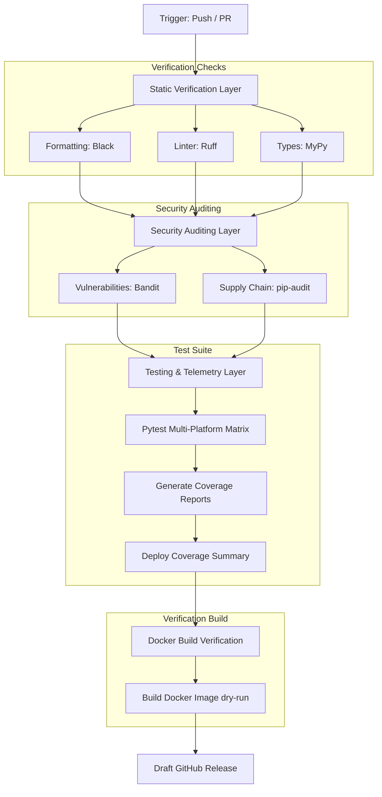

# Production CI/CD Integration & DevOps Architecture Guide
### GitHub Actions Pipelines, Dependency Scanning, Verification Matrices, and Release Automation

This guide outlines the production CI/CD architecture designed for Hitesh Yadav's project repository suite. It establishes strict rules for secure deployments, static verification, unit testing, docker building, and automated version releases.

---

## 1. Directory Structure

For any repository adopting these DevOps pipelines, structure files as follows:

```
<project-root>/
├── .github/
│   ├── dependabot.yml           # Automated dependency updates config
│   ├── pull_request_template.md # Standard PR checks template
│   └── workflows/
│       ├── ci.yml               # Core verification & build pipeline
│       └── release.yml          # Tag-triggered automated release engine (optional)
├── Dockerfile                   # Deployment container blueprint
└── requirements.txt / go.mod    # Dependency manifests
```

---

## 2. Configured GitHub Action Jobs (Python Matrix)

A production-grade Python pipeline executes the following checks sequentially:



---

## 3. Required Github Repository Secrets

To activate the publishing features of the CI/CD pipeline, navigate to your repository's **Settings > Secrets and variables > Actions** and declare the following variables:

| Secret Key | Description | Scope / Access Requirement |
| :--- | :--- | :--- |
| `PYPI_API_TOKEN` | API Token for publishing built packages to PyPI. | Required if automated package deployment is enabled. |
| `DOCKERHUB_USERNAME` | Your Docker Hub account username. | Required to push production containers to Docker Hub. |
| `DOCKERHUB_TOKEN` | API Token generated under your Docker Hub account. | Used to authenticate Docker pushes securely. |
| `GITHUB_TOKEN` | Automated GitHub token (provided by GitHub environment). | Used to create tags, compile change logs, and publish drafts. |

---

## 4. Markdown Integration Badges (Copy & Paste)

Insert these badges at the top of your repository `README.md` files (replace `beast6713` and `<repository-name>` with your actual project details):

```markdown
<!-- Workflow Status Badge -->
[](https://github.com/beast6713/<repository-name>/actions/workflows/ci.yml)

<!-- Security Auditing Badge -->
[](https://github.com/beast6713/<repository-name>/actions)

<!-- Code Coverage Status -->
[](https://github.com/beast6713/<repository-name>/actions)

<!-- Automated Dependency Updates -->
[](https://github.com/beast6713/<repository-name>/blob/main/.github/dependabot.yml)
```

---

## 5. Security & Verification Rules

1.  **Strict Linting**: The pipeline utilizes `Ruff` and `MyPy`. Warnings or type deviations will fail the build immediately.
2.  **Zero Vulnerabilities Policy**: If `Bandit` or `pip-audit` detects any high/medium severity findings, the workflow will terminate, preventing execution down the line.
3.  **Docker Dry Run**: Docker builds are performed with caching to ensure container compilation succeeds on changes, preventing broken images from getting published.
4.  **Automated Draft Releases**: Whenever a tag formatted as `v*` (e.g. `v1.0.0`) is pushed, the release engine runs. It compiles a changelog, packages source wheels, and generates a draft release on GitHub.
