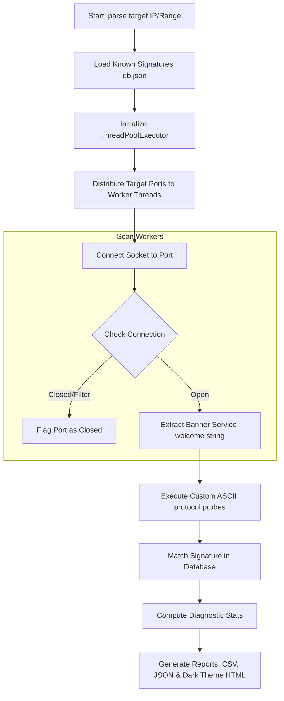
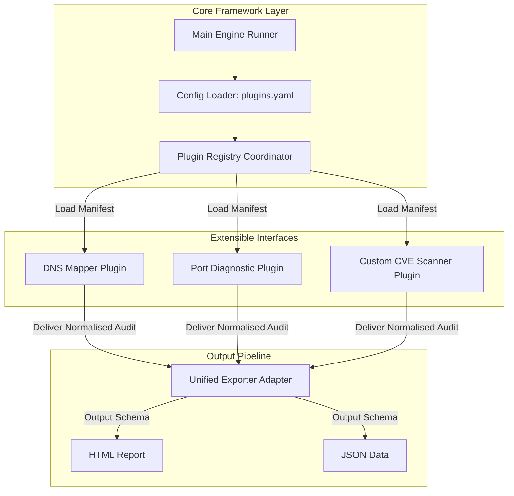
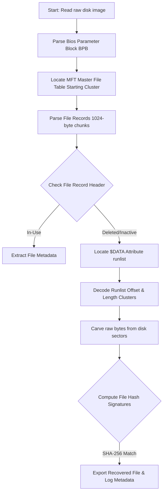
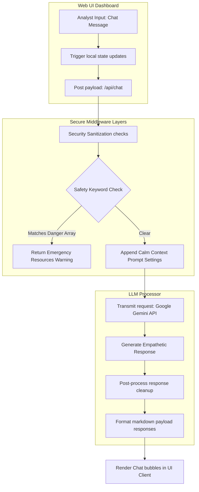
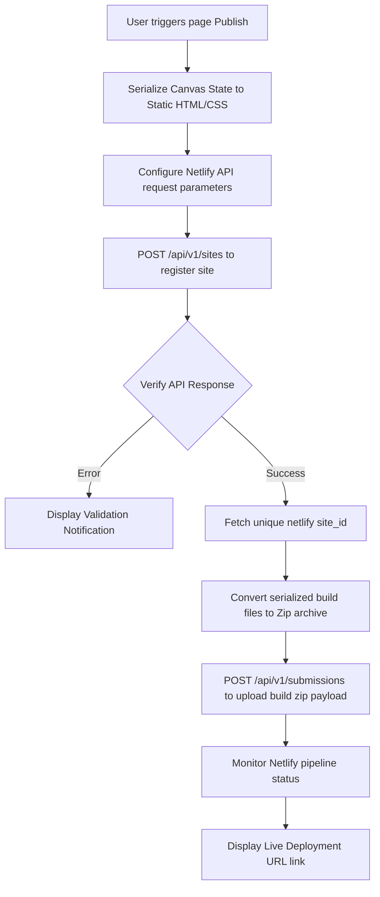

# Enterprise Documentation Design System & Master Blueprint
#### Standardized Visual Assets, Structural Diagrams, and UI/UX Specifications for Hitesh Yadav's Project Portfolio

This document contains production-grade documentation blueprints for Hitesh Yadav's core projects. All specifications are designed to meet the aesthetic and structural standards of **Microsoft Learn, GitHub Docs, and Docker Documentation**.

---

# Core Visual Branding & Theme Token Guidelines
To maintain consistency across all repositories, use these global documentation theme specifications:
*   **Font Typography**: `Inter` for body copy, `Fira Code` for monospace/CLI syntax, and `SF Pro Display` for headers.
*   **Alert/Callout Formatting**: Standard GitHub Alerts (`> [!NOTE]`, `> [!IMPORTANT]`, `> [!WARNING]`).
*   **Badges**: Dynamic badge configurations generated via `img.shields.io` incorporating matching brand colors.
*   **Screenshot Framing**: 3px rounded border (`border-radius: 8px`) with a soft drop shadow (`box-shadow: 0 4px 20px rgba(0,0,0,0.4)`).
*   **Camera Angle (UI/Screenshots)**: Straight orthographic front-on view (no perspective tilt or mock laptop frame wrapping unless specified).

---

## Project 01: IP-Sentinel (IPIP)
> Unified enterprise-grade Clean Architecture threat intelligence correlation platform.

### 01. Branding & Theme Tokens
*   **Primary Palette**: Space Dark (`#030712`), Slate Surface (`#1E293B`), Cyber Cyan Accent (`#00F0FF`), Neon Violet Accent (`#7C3AED`).

### 02. Professional Badges
```markdown
[](https://go.dev)
[](https://nextjs.org)
[](https://redis.io)
[](https://github.com/beast6713/IP-Sentinel)
```

### 03. Hero Banner Layout Design
*   **Dimensions**: 1200x400 SVG.
*   **Layout**: Split grid. On the left: large, bold typography `IP-SENTINEL` (Cyan glowing stroke) with subtitles `Clean Architecture Threat Data Correlator`. On the right: A vector wireframe globe showing glowing node arcs connecting to threat databases.
*   **Background**: Deep black-navy radial gradient (`#02040a` to `#0B0F19`).

### 04. Folder Structure Visualization
```
ip-sentinel/
├── cmd/
│   └── cli/                # Command Line entrypoint
├── configs/                # YAML Configuration schemas
├── deployments/            # Docker Compose orchestration
├── internal/               # Core application boundary
│   ├── entity/             # Core threat domain structures
│   ├── usecase/            # Application business rules
│   │   ├── pipeline/       # Parallel investigation engine
│   │   └── scoring/        # Threat risk score algorithms
│   └── adapter/            # Controller layers & DB drivers
│       ├── database/       # PostgreSQL models & repositories
│       ├── cache/          # Redis storage operations
│       └── provider/       # Threat APIs integration adapters
└── web/                    # Next.js 14 SOC dashboard interface
```

### 05. Architecture & Network Topology Diagram
```mermaid
graph TD
    %% Styling
    classDef client fill:#030712,stroke:#00F0FF,stroke-width:2px,color:#fff;
    classDef server fill:#1E293B,stroke:#7C3AED,stroke-width:2px,color:#fff;
    classDef data fill:#0B0F19,stroke:#64748B,stroke-width:1px,color:#fff;

    subgraph Client Layer
        CLI[ipip CLI Binary]::client
        WebUI[Next.js SOC Dashboard]::client
    end

    subgraph Core Engine [Clean Architecture Boundary]
        API[Go REST API Router]::server
        UC[Usecase: Investigation Coordinator]::server
        Pipe[Parallel Collection Engine]::server
        Score[Risk Scorer Engine]::server
    end

    subgraph Adapters & Storage
        Cache[(Redis Cache)]::data
        DB[(PostgreSQL 16)]::data
        WHOIS[WHOIS Engine API]::data
        DNS[DNS Resolvers]::data
        ThreatAPI[Custom Threat APIs]::data
    end

    %% Wiring
    CLI -->|REST / Port 8080| API
    WebUI -->|Fetch API| API
    API --> UC
    UC --> Pipe
    UC --> Score
    Pipe -->|Check Cache| Cache
    Pipe -->|Query Parallel| WHOIS
    Pipe -->|Query Parallel| DNS
    Pipe -->|Query Parallel| ThreatAPI
    UC -->|Log Investigation| DB
```

### 06. API Flow Chart
```mermaid
sequenceDiagram
    autonumber
    actor Analyst as Security Analyst
    participant Web as Next.js Web Interface
    participant Go as Go Backend Router
    participant Cache as Redis Caching Service
    participant Engine as Collection Engine
    participant API as External Threat API

    Analyst->>Web: Request Investigation (185.220.101.5)
    Web->>Go: POST /api/v1/investigate {ip: "185.220.101.5"}
    Go->>Cache: GET threat_cache:185.220.101.5
    alt Cache Hit
        Cache-->>Go: Return Normalized Threat Intelligence
        Go-->>Web: 200 OK (Response time: &lt;1ms)
    else Cache Miss
        Cache-->>Go: Nil
        Go->>Engine: Spawn Parallel Query Workers
        par Worker 1 - DNS
            Engine->>API: Query IP PTR Records
            API-->>Engine: Returns PTR Data
        and Worker 2 - WHOIS
            Engine->>API: Query WHOIS Record details
            API-->>Engine: Returns WHOIS Info
        end
        Engine->>Go: Consolidate & Calculate Threat Score (e.g. 75/100)
        Go->>Cache: SETEX threat_cache:185.220.101.5 86400 (JSON)
        Go-->>Web: 200 OK (Response time: ~450ms)
    end
    Web->>Analyst: Render Interactive Security Topology
```

### 07. UI Dashboard Mockup Screenshot Recipe
*   **What should be shown**: The complete operational control dashboard showing active threat velocities, geo-location charts, and the live loading panel.
*   **Camera Angle**: Flat front-on UI view.
*   **Resolution**: 1920x1080px.
*   **Colors**: Surface slate background (`#0D1117`), dark grey tables (`#161B22`), threat warning alert (`#F85149`), safe ASN (`#56D364`), grid neon borders (`#30363D`).
*   **Labels**: "IP-SENTINEL: Active Threat Radar", "Top Offending ASNs", "Origin Geo-Map", "Risk Score Meter".
*   **UI Layout**: Left sidebar containing navigation menu. Main grid panel: Top row contains KPI metric cards (Total Audits, High Threats, Active ASNs). Middle panel contains a map showing line coordinates and threat score ring. Right panel lists the live-updating logs.

---

## Project 02: PortFootprint
> Multi-threaded TCP Port Scanner and service fingerprinting CLI engine.

### 01. Branding & Theme Tokens
*   **Primary Palette**: Industrial Dark (`#0C0D0E`), Charcoal (`#1F2937`), Emerald Accent (`#10B981`), Cobalt Accent (`#3B82F6`).

### 02. Professional Badges
```markdown
[](https://python.org)
[](https://github.com/beast6713/PortFootprint)
[](https://github.com/beast6713/PortFootprint)
```

### 03. Hero Banner Layout Design
*   **Dimensions**: 1200x400 SVG.
*   **Layout**: Left-heavy alignment. Left text: bold `PORTFOOTPRINT` in vibrant Emerald, subtitle `Concurrent Network Socket Fingerprinter`. Right side: An interactive, clean terminal display showcasing active connection threads scanning ports `22`, `80`, and `443` concurrently.
*   **Background**: Deep Charcoal gradient.

### 04. Folder Structure Visualization
```
portfootprint/
├── docs/                       # Architectural sub-guides
├── portfootprint/
│   ├── __init__.py
│   ├── cli.py                  # CLI Command parser
│   ├── engine.py               # Concurrent socket scanning engine
│   ├── fingerprint.py          # Banner parsing & protocol signature matcher
│   ├── report.py               # CSV/JSON/HTML generators
│   └── database.json           # Known service banner signatures
├── tests/                      # Unit testing suite
├── pyproject.toml              # Build & dependency declarations
└── main.py                     # Global run entrypoint
```

### 05. Workflow Execution Diagram


### 06. Terminal Output Screenshot Recipe
*   **What should be shown**: A dark terminal window executing a network scan against a host, displaying color-coded results and thread speed metrics.
*   **Camera Angle**: Clean front-facing terminal console.
*   **Terminal Commands**: `python main.py investigate 192.168.1.1 --ports 1-1024 --threads 50 --compare previous.json`
*   **Resolution**: 1200x750px.
*   **Colors**: Terminal background (`#0A0E17`), Text/Logs (`#E2E8F0`), Open port (`#10B981` green), Service banner (`#3B82F6` blue), Time statistics (`#F59E0B` yellow).
*   **Labels**: "PortFootprint CLI v1.2.0", "Thread Allocation Map", "Scan Result Table".
*   **UI Layout**: Text output showing scanner initialization, total thread allocations, and a clean ASCII table displaying scanned ports, connection states, banner strings, and the identified protocol.

---

## Project 03: VulnReconX
> Extensible, Clean Architecture security reconnaissance and vulnerability scanning framework.

### 01. Branding & Theme Tokens
*   **Primary Palette**: Obsidian Green (`#040804`), Matrix Dark Surface (`#0E140E`), Lime Green Accent (`#22C55E`), Gold Accent (`#F59E0B`).

### 02. Professional Badges
```markdown
[](https://github.com/beast6713/VulnReconX)
[](https://docs.pytest.org)
[](https://github.com/beast6713/VulnReconX)
```

### 03. Hero Banner Layout Design
*   **Dimensions**: 1200x400 SVG.
*   **Layout**: Center-oriented. Large matrix-styled `VULNRECONX` title in neon green. Graphic nodes mapping to core logic modules (`Resolver`, `Scanner`, `Exporter`). 
*   **Background**: Radial dark green-black gradient.

### 04. Folder Structure Visualization
```
vulnreconx/
├── config/
│   └── plugins.yaml            # Enabled plugin configurations
├── src/
│   ├── core/
│   │   ├── domain/             # Domain logic & configuration schemas
│   │   ├── usecase/            # Execution pipeline controller
│   │   └── interfaces/         # Plugin boundary interfaces
│   └── plugins/
│       ├── base.py             # Abstract base plugin contract
│       ├── dns_resolver.py     # Subdomain mapper plugin
│       └── port_scanner.py     # Port probe plugin
└── tests/                      # Testing matrix
```

### 05. Plugin Registry Diagram


### 06. Terminal Output Screenshot Recipe
*   **What should be shown**: The CLI bootstrapping process loading security scanning plugins, running preflight validation checks, and showing execution.
*   **Camera Angle**: Desktop terminal console snapshot.
*   **Terminal Commands**: `python -m vulnreconx.main --target vulnerability.com --scan-all`
*   **Resolution**: 1280x800px.
*   **Colors**: Terminal dark green theme (`#0D160D`), system notices in Lime (`#22C55E`), error notifications in Amber (`#F59E0B`).
*   **Labels**: "VULNRECONX ENGINE", "PLUGIN REGISTRY LOAD MATRIX", "PREFLIGHT AUDIT".
*   **UI Layout**: Text output detailing directory scan detections, YAML config validation success messages, and listing active plugin status indicators.

---

## Project 04: NTFS Forensic Recovery Tool
> Standalone digital forensics tool to parse raw NTFS disk partitions and reconstruct deleted artifacts.

### 01. Branding & Theme Tokens
*   **Primary Palette**: Slate Forensics (`#0B0F19`), Steel Blue (`#1E293B`), Sky Blue Accent (`#38BDF8`), Forensic Gray (`#94A3B8`).

### 02. Professional Badges
```markdown
[](https://github.com/beast6713/ntfs-forensic-recovery)
[](https://github.com/beast6713/ntfs-forensic-recovery)
[](https://github.com/beast6713/ntfs-forensic-recovery)
```

### 03. Hero Banner Layout Design
*   **Dimensions**: 1200x400 SVG.
*   **Layout**: Clean and technical. Title: `NTFS DELETED RECOVERY` in Sky Blue. Right: Vector mapping of partition sectors, displaying raw bytes matching ASCII headers.
*   **Background**: High-contrast dark charcoal to forensic slate gradient.

### 04. Folder Structure Visualization
```
ntfs-recovery/
├── docs/                       # NTFS specification guidelines
├── src/
│   ├── disk/
│   │   └── reader.py           # Raw disk byte stream handler
│   ├── ntfs/
│   │   ├── boot.py             # BIOS Parameter Block (BPB) parser
│   │   ├── mft.py              # Master File Table record reader
│   │   └── runlist.py          # Data runlist decoder (fragmented parsing)
│   ├── carving/
│   │   └── signature.py        # Magic numbers file carver
│   └── main.py                 # Core CLI entrypoint
└── tests/
```

### 05. NTFS Binary Parsing Workflow


### 06. Terminal Output Screenshot Recipe
*   **What should be shown**: CLI execution reading a raw `.dd` partition file, showing directory reconstruction tables, and highlighting recovered deleted files.
*   **Camera Angle**: Clean front-facing terminal.
*   **Terminal Commands**: `python main.py parse /dev/sdb1 --recover --output ./recovered_files/`
*   **Resolution**: 1440x900px.
*   **Colors**: Dark background (`#0B0F17`), recovered items in Light Blue (`#38BDF8`), active warning alerts in Red (`#EF4444`).
*   **Labels**: "NTFS MFT Parser Tool v2.1", "Directory Structure Reconstruction", "Forensic Integrity Check".
*   **UI Layout**: Text output displaying target partitions parameters, sector metrics, directory indices, and logs calculating MD5 signatures.

---

## Project 05: MindEase
> AI-assisted mental wellness platform with Next.js, Google Gemini, and interactive relaxation spaces.

### 01. Branding & Theme Tokens
*   **Primary Palette**: Indigo Twilight (`#080711`), Amethyst Surface (`#171329`), Violet Pastel Accent (`#A78BFA`), Sky Pastel Accent (`#38BDF8`).

### 02. Professional Badges
```markdown
[](https://ai.google.dev)
[](https://developer.mozilla.org/en-US/docs/Web/API/Canvas_API)
```

### 03. Hero Banner Layout Design
*   **Dimensions**: 1200x400 SVG.
*   **Layout**: Fluid, minimal layout. Title `MindEase` in glowing pastel violet, subtitle `AI-Powered Sensory relaxation workspace`. On the right: Fluid canvas particle wave structures rendered in vector gradients.
*   **Background**: Deep lavender-midnight radial gradient.

### 04. Folder Structure Visualization
```
mindease/
├── public/                     # Static media assets & Canvas configs
├── src/
│   ├── components/
│   │   ├── chatbot/            # Gemini-powered safety chat ui
│   │   ├── timer/              # Pomodoro wellness focus timers
│   │   └── workspace/          # HTML5 Canvas fluid particle engine
│   ├── lib/
│   │   ├── gemini.ts           # Gemini API middleware & safety filters
│   │   └── db.ts               # Database connector
│   └── app/
│       ├── dashboard/          # Wellness activity tracker
│       └── page.tsx            # Landing viewport
```

### 05. AI Conversation Flow Chart


### 06. Web Dashboard Mockup Screenshot Recipe
*   **What should be shown**: The wellness dashboard viewport displaying custom Pomodoro tracking rings, conversation portals, and the sensory canvas canvas.
*   **Camera Angle**: Flat web dashboard viewport mockup.
*   **Resolution**: 1920x1080px.
*   **Colors**: Deep violet background (`#0A0915`), modal surface (`#121021`), text (`#F3F4F6`), canvas particles (`#A78BFA` to `#38BDF8` gradient).
*   **Labels**: "MindEase Space", "Sensory Relaxation Matrix", "Empathetic Assistant".
*   **UI Layout**: Left panel houses the chatbot workspace. Right panel houses focus timer metric settings. Center region renders the interactive HTML5 Canvas element.

---

## Project 06: Royal Stitch Market
> Bespoke apparel and multi-vendor tailoring e-commerce application.

### 01. Branding & Theme Tokens
*   **Primary Palette**: Gold Onyx (`#050505`), Obsidian Dark (`#111111`), Amber Accent (`#D97706`), Neutral Gray (`#6B7280`).

### 02. Professional Badges
```markdown
[](https://clerk.com)
[](https://supabase.com)
[](https://zod.dev)
```

### 03. Hero Banner Layout Design
*   **Dimensions**: 1200x400 SVG.
*   **Layout**: Balanced, high-end branding layout. Left: Large typography `ROYAL STITCH` in amber gold color. Right: Graphic outline of bespoke measuring templates overlaying SQL data schemas.
*   **Background**: Absolute black-onyx linear gradient.

### 04. Folder Structure Visualization
```
royal-stitch/
├── src/
│   ├── middleware.ts           # Clerk token verification & RBAC gateways
│   ├── components/
│   │   ├── admin/              # Tailor sales analytics dashboard UI
│   │   └── checkout/           # Checkout & measurement forms
│   ├── schemas/
│   │   └── measurement.ts      # Zod validation schemas
│   └── app/
│       ├── customer/           # Customer storefront routes
│       ├── tailor/             # Tailor inventory route controllers
│       └── page.tsx            # Marketplace landing
```

### 05. Authorization Security Architecture
```mermaid
graph TD
    %% Styling
    classDef boundary fill:#111,stroke:#D97706,stroke-width:2px,color:#fff;
    classDef client fill:#050505,stroke:#6B7280,stroke-width:1px,color:#fff;

    subgraph Client Application
        C[Visitor / User Agent]::client
    end

    subgraph Security Gateway [Middleware Layer]
        M{Middleware Access Gate}::boundary
        Cl[Clerk Token Authenticator]::boundary
        R{Check Role Claim}::boundary
    end

    subgraph SQL Database [Supabase Storage]
        S[(PostgreSQL DBMS)]::boundary
        RLS{Row-Level Security Policies}::boundary
    end

    %% Wiring
    C -->|Request Access /tailor/dashboard| M
    M --> Cl
    Cl -->|Verify Session| R
    R -->|Is Admin / Tailor| T[Allow Route Access]
    R -->|Is Customer| D[Redirect 403 Forbidden]
    T -->|Query Tables| S
    S --> RLS
    RLS -->|Matches user_id| O[Return Records]
```

### 06. Web Dashboard Mockup Screenshot Recipe
*   **What should be shown**: The vendor-tailor dashboard displaying recent custom dress commissions, customer sizing databases, and monthly revenue performance graphs.
*   **Camera Angle**: Clean front-on browser viewport mockup.
*   **Resolution**: 1920x1080px.
*   **Colors**: Obsidian background (`#0A0A0A`), panel container borders (`#1F1F1F`), primary text (`#EDEDED`), gold accents (`#D97706`).
*   **Labels**: "Royal Stitch Management Portal", "Recent Tailoring Orders", "Measurement Specifications".
*   **UI Layout**: Standard sidebar menu. Upper section showcases performance stats. Main content area displays measurement profiles and order tracking boards.

---

## Project 07: Velocity Builder
> Interactive drag-and-drop website assembly and Netlify API publishing platform.

### 01. Branding & Theme Tokens
*   **Primary Palette**: Navy Cyber (`#0B0F19`), Space Blue (`#1E293B`), Electric Orange (`#F97316`), Glowing Cyan (`#00F0FF`).

### 02. Professional Badges
```markdown
[](https://dndkit.com)
[](https://vitejs.dev)
```

### 03. Hero Banner Layout Design
*   **Dimensions**: 1200x400 SVG.
*   **Layout**: Split grid alignment. Left: `VELOCITY BUILDER` in electric orange, subtitle `No-Code static page compiler & direct Netlify publisher`. Right: A clean diagram of dragging nodes snaps into layout blocks.
*   **Background**: High-contrast space blue to obsidian gradient.

### 04. Folder Structure Visualization
```
velocity-builder/
├── src/
│   ├── context/
│   │   └── HistoryContext.tsx   # Undo / Redo action history state tracker
│   ├── components/
│   │   ├── canvas/             # Drag area layout grid
│   │   ├── toolbox/            # Draggable website blocks
│   │   └── publisher/          # Netlify API publish controller
│   └── app.tsx                 # Core UI dashboard coordinator
```

### 05. Publishing Pipeline Diagram


### 06. Builder Mockup Screenshot Recipe
*   **What should be shown**: The live builder workspace viewport showing web layout sections, component libraries, and publishing modals.
*   **Camera Angle**: Flat web browser UI viewport.
*   **Resolution**: 1920x1080px.
*   **Colors**: Canvas workspace background (`#0F172A`), toolbox columns (`#1E293B`), highlight drop points (`#00F0FF`), deployment metrics (`#F97316`).
*   **Labels**: "Velocity Workspace", "Element Toolbox", "Build Status: Ready".
*   **UI Layout**: Left panel: Element toolbox (headers, columns, media nodes). Center: Responsive website mockup canvas displaying active layout blocks. Right panel: Style configuration properties.

---

# Custom Documentation Callout Box Standards
All callouts used in project manuals must use the following standard style structures:

> [!NOTE]
> Standard implementation guidelines or context updates. Use to represent developer environment setups.

> [!IMPORTANT]
> Design critical configurations, api key installations, or token authorization rules.

> [!WARNING]
> Security alerts, database credential exposures, and unpatched configuration options.
