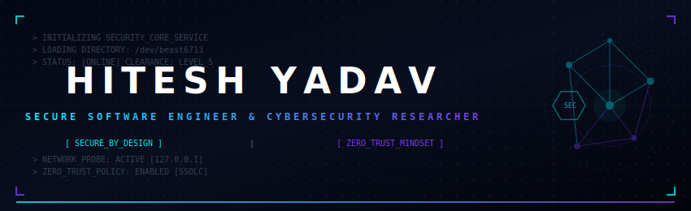

# Hitesh Yadav
### Secure Software Engineer & Cybersecurity Researcher

<p align="center">
  
</p>

<div align="center">

[](https://git.io/typing-svg)

[](https://www.linkedin.com/in/hiteshyadav6713/)
[](mailto:kunjeyanhitesh13@gmail.com)
[](https://github.com/beast6713)
[](RESUME_ENHANCED.pdf)

</div>

---

## 0x01 | Profile Summary

I am a Computer Science Engineering student specializing in **Cybersecurity** at SRM Institute of Science & Technology, Chennai (Expected Graduation: May 2028 | GPA: 9.52/10). 

My engineering core focus is on the boundary where high-performance software engineering meets defensive security. I believe security must be architected into software at the design phase rather than added as a deployment patch. By studying low-level systems (such as NTFS disk structures, TCP socket routines, and authorization boundaries), I build robust applications that are secure by design.

---

## 0x02 | Core Engineering Gateway

To understand my approach to code quality, software architecture, and incident response, explore these master documents:

*   **[DevOps & Actions Guide](DEVOPS_INTEGRATION_GUIDE.md)**: Specifications for my automated testing, static analysis (Black, Ruff, MyPy, Bandit), dependency supply chain vulnerability scanning (`pip-audit`), and Docker build pipelines.
*   **[Documentation & Blueprint Master](DOCUMENTATION_BLUEPRINT.md)**: Architectural blueprints, execution flowcharts, API schemas, and network topologies for my projects.

---

## 0x03 | Cybersecurity Research

My projects and academic study focus on the following domains:

*   **Digital Forensics & Incident Response (DFIR)**: Low-level file system structure analysis (NTFS metadata, $MFT records), file carving techniques, and scripting Wireshark/PCAP data extraction.
*   **Secure Web Architecture**: Enforcing input boundary sanitization (using strict Zod schemas), mitigating OWASP Top 10 vulnerabilities, and securing API routers with stateless JWT signatures and database Row-Level Security (RLS).
*   **Network Diagnostics**: Socket-level programming in Python/Go, banner-grabbing heuristics, and automating preflight routing verifications.
*   **Systems Hardening**: Configuring isolated container runtimes with Docker multi-stage builds and applying least-privilege configurations to cloud identity systems (AWS IAM).

---

## 0x04 | Technical Stack

### Core Languages
`Python` • `Go (Golang)` • `C++` • `C` • `TypeScript` • `JavaScript (ES6+)` • `Bash / Shell`

### Backend & Databases
`Node.js` • `Express.js` • `PostgreSQL` • `Redis` • `Supabase` • `MongoDB` • `MySQL` • `SQLite`

### Cloud & DevOps
`Docker` • `AWS (Foundational Security & IAM)` • `Git & GitHub Actions` • `Netlify API`

### Diagnostics & Forensics
`Linux / Unix Systems` • `Wireshark / TShark` • `Nmap` • `Burp Suite` • `Socket Programming` • `VirtualBox`

---

## 0x05 | Telemetry Dashboard

<div align="center">

| Profile Analytics | Language Telemetry |
| :---: | :---: |
|  |  |

</div>

<br />

<div align="center">

<!-- Daily contribution activity graph -->
[](https://github.com/beast6713)

</div>

<br />

<div align="center">

<!-- Platane Snake contribution animation -->
<picture>
  <source media="(prefers-color-scheme: dark)" srcset="https://raw.githubusercontent.com/beast6713/beast6713/output/github-contribution-grid-snake-dark.svg">
  <source media="(prefers-color-scheme: light)" srcset="https://raw.githubusercontent.com/beast6713/beast6713/output/github-contribution-grid-snake.svg">
  
</picture>

</div>

---

## 0x06 | Active Work Matrix

*   **Building**: Upgrading [IP-Sentinel](https://github.com/beast6713/IP-Sentinel)'s parallel collection engine to support rate-limited threat intel providers.
*   **Learning**: Deepening my understanding of Linux Kernel internals, virtual memory architectures, and container namespaces.
*   **Exploring**: Studying network traffic analysis patterns in raw PCAP files to automate threat signature mapping.
*   **Researching**: Practical mitigation patterns for Server-Side Request Forgery (SSRF) in distributed microservice routing architectures.

---

## 0x07 | Open Source & Collaboration

I believe that open-source software is critical for establishing a secure public digital infrastructure. I am interested in collaborating on:
1.  **Defensive Tooling**: Automation scripts, parsing libraries, and network scanners built in Python, Go, or C++.
2.  **Architectural Blueprinting**: Writing documentation and designing clean, reproducible project layouts.
3.  **AppSec Auditing**: Reviewing application codebases for proper input validation and boundary protections.

---

## 0x08 | Contact & Verification

If you are looking for an application security or software engineering intern, or want to collaborate on security projects:

*   **Email**: [kunjeyanhitesh13@gmail.com](mailto:kunjeyanhitesh13@gmail.com)
*   **LinkedIn**: [linkedin.com/in/hiteshyadav6713](https://www.linkedin.com/in/hiteshyadav6713)
*   **GitHub**: [github.com/beast6713](https://github.com/beast6713)

---

<div align="center">

```
==================================================================================================
                 "Security is a process, not a product." — Bruce Schneier
==================================================================================================
```

<sub>Designed and verified by <b>Hitesh Yadav</b>. Built with clean code and systems precision.</sub><br />
<sub>© 2026 Hitesh Yadav. All rights reserved.</sub>

</div>
