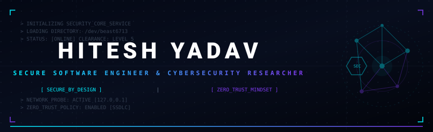

# Hitesh Yadav
### Secure Software Engineer & Cybersecurity Specialist

<p align="center">
  
</p>

<div align="center">

[](https://git.io/typing-svg)

[](https://www.linkedin.com/in/hiteshy13/)
[](mailto:kunjeyanhitesh13@gmail.com)
[](https://hitesh-portfolio-beast6713s-projects.vercel.app)
[](Resume.pdf)

</div>

---

## 0x01 | Profile Summary

I am a Computer Science Engineering student specializing in **Cybersecurity** at SRM Institute of Science & Technology, Chennai (**Expected Graduation: May 2028 | GPA: 9.52/10**). 

My engineering core focus is on the boundary where high-performance software engineering meets defensive security and vulnerability verification. I believe security must be architected into software at the design phase rather than added as a deployment patch. By studying low-level systems (such as raw NTFS disk structures, TCP socket routines, AST rule validators, and authorization boundaries), I build robust applications that are secure by design.

---

## 0x02 | Core Engineering Gateway

To understand my approach to code quality, software architecture, and security engineering, explore these master blueprints:

*   **[HTTP Security Assessment Framework](https://github.com/beast6713/http-security-framework)**: My flagship 10-phase modular web security assessment engine built with Single Source of Truth architecture, Playwright browser verification, OWASP ZAP cross-validation, and 92.24% test coverage.
*   **[IP-Sentinel Threat Platform](https://github.com/beast6713/IP-Sentinel)**: High-concurrency Go threat correlation engine built with Clean Architecture, parallel collection workers, Redis caching, and Next.js SOC dashboard.
*   **[VulnReconX Recon Framework](https://github.com/beast6713/VulnReconX)**: Extensible security reconnaissance framework with YAML manifest plugin registry and SOLID boundary separation.
*   **[DevOps & Actions Guide](DEVOPS_INTEGRATION_GUIDE.md)**: Specifications for my automated testing, static analysis (Black, Ruff, MyPy, Bandit), dependency supply chain vulnerability scanning (`pip-audit`), and Docker build pipelines.
*   **[Documentation & Blueprint Master](DOCUMENTATION_BLUEPRINT.md)**: Architectural blueprints, execution flowcharts, API schemas, and network topologies for my projects.

---

## 0x03 | Research & Core Focus Domains

My projects and academic study focus on the following domains:

*   **Digital Forensics & Incident Response (DFIR)**: Low-level file system structure analysis (NTFS metadata, `$MFT` records), file carving techniques, and scripting Wireshark/PCAP data extraction.
*   **Secure Web Architecture**: Enforcing input boundary sanitization (using strict Zod schemas), mitigating OWASP Top 10 vulnerabilities, and securing API routers with stateless JWT signatures and database Row-Level Security (RLS).
*   **Network Diagnostics**: Socket-level programming in Python/Go, banner-grabbing heuristics, and automating preflight routing verifications.
*   **Systems Hardening**: Configuring isolated container runtimes with Docker multi-stage builds and applying least-privilege configurations to cloud identity systems (AWS IAM).

---

## 0x04 | Technical Stack

### Core Languages
`Python 3.12+` • `Go (Golang)` • `C++` • `TypeScript` • `JavaScript (ES6+)` • `Bash / Shell`

### Security & Forensics
`Playwright` • `OWASP ZAP API` • `Reflected XSS Verification` • `NTFS Binary Parsing` • `PyYAML Plugin Engines` • `Wireshark / TShark` • `Nmap` • `Burp Suite` • `Socket Programming`

### Backend & Databases
`Node.js` • `Express.js` • `PostgreSQL` • `Redis` • `Supabase` • `MongoDB` • `MySQL` • `SQLite`

### Cloud & DevOps
`Docker & Compose` • `AWS (Foundational IAM)` • `Git & GitHub Actions` • `pytest-cov` • `Mypy / Ruff`

---

## 0x05 | Active Work Matrix

*   **Released**: **HTTP Security Assessment Framework (v2.0.0)** — Complete 10-phase production release with 92.24% test coverage and OWASP ZAP cross-validation.
*   **Building**: Upgrading [IP-Sentinel](https://github.com/beast6713/IP-Sentinel)'s parallel collection engine to support rate-limited threat intel providers.
*   **Learning**: Deepening my understanding of Linux Kernel internals, virtual memory architectures, and container namespaces.
*   **Researching**: Practical mitigation patterns for Server-Side Request Forgery (SSRF) in distributed microservice routing architectures.

---

## 0x06 | Contact & Verification

If you are looking for an application security, cybersecurity, or software engineering intern, or want to collaborate on security projects:

*   **Email**: [kunjeyanhitesh13@gmail.com](mailto:kunjeyanhitesh13@gmail.com)
*   **LinkedIn**: [linkedin.com/in/hiteshy13](https://www.linkedin.com/in/hiteshy13/)
*   **GitHub**: [github.com/beast6713](https://github.com/beast6713)
*   **Resume**: [Resume.pdf](Resume.pdf) | [Resume.md](Resume.md)

---

<div align="center">

```
==================================================================================================
                 "Security is a process, not a product." — Bruce Schneier
==================================================================================================
```

<sub>Designed and verified by <b>Hitesh Yadav</b>. Built with clean code, dark castle aesthetics, and systems precision.</sub><br />
<sub>© 2026 Hitesh Yadav. All rights reserved.</sub>

</div>
